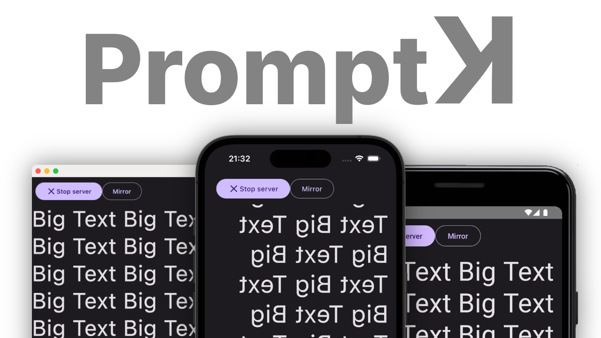

# PromptK: Multiplatform Teleprompter App

_Built originally [live on air](https://twitch.tv/sebi_io) by [Sebastian Aigner](https://github.com/sebastianaigner) and
[Marton Braun](https://github.com/zsmb13)!_

- Built entirely using Kotlin Multiplatform and Compose Multiplatform
- Available on Android, iOS, and Desktop
- Embedded web interface for remote controlling the teleprompter
- Built in [Fleet](https://blog.jetbrains.com/kotlin/2023/11/kotlin-multiplatform-tooling-in-fleet/)!

This is a Kotlin Multiplatform project targeting Android, iOS, Desktop.

* `/composeApp` is for code that will be shared across your Compose Multiplatform applications.
  It contains several subfolders:
    - `commonMain` is for code that’s common for all targets.
    - Other folders are for Kotlin code that will be compiled for only the platform indicated in the folder name.
      For example, if you want to use Apple’s CoreCrypto for the iOS part of your Kotlin app,
      `iosMain` would be the right folder for such calls.

* `/iosApp` contains iOS applications. Even if you’re sharing your UI with Compose Multiplatform,
  you need this entry point for your iOS app. This is also where you should add SwiftUI code for your project.

Learn more about [Kotlin Multiplatform](https://www.jetbrains.com/help/kotlin-multiplatform-dev/get-started.html)…

## Things we can explore in this repository

- [x] Resolve server startup hiccups
- [x] Set title of Desktop app
- [x] Tutorial popup showing the IP address
- [x] Functional tutorial popup to open the server or copy the address or share it or something
    - [x] "Go" button on iOS
- [ ] Scroll speed control
- [ ] Make sure that on iOS, sharing the URL doesn't dismiss the blur/popup
- [ ] Amper build system
- [ ] Onboarding page
- [ ] Beautify the web interface
    - [x] Dark mode
- [ ] Highlight active line of prompter
- [x] Make sure Ktor server on Desktop doesn't only bind on `localhost`
- [ ] Make sure reopening server on iOS doesn't cause "address already in use"
- [x] Write a test
    - [ ] Use power assert
- [x] Add basic localization
    - [x] Allow per-app language choice on Android
    - [ ] Remove workaround for Compose state in templated string resource